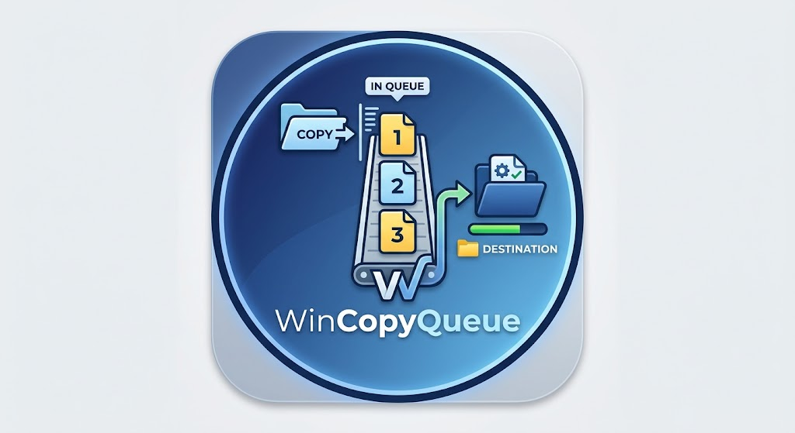

<p align="center">
  
</p>

# WinCopyQueue

WinCopyQueue dodaje do Eksploratora Windows prostą kolejkę kopiowania i przenoszenia plików. Zamiast uruchamiać kilka transferów równocześnie, wykonuje je po kolei — jedna sesja po drugiej i jeden plik naraz.

Program działa w zasobniku systemowym i nie zajmuje ekranu stałym oknem. Panel kolejki pojawia się dopiero po dodaniu transferu, można go w każdej chwili ukryć, a kopiowanie będzie działać dalej.

## Pobieranie

Aktualna wersja: **1.0.0**

- [Pobierz instalator WinCopyQueue 1.0.0](https://github.com/quendae/WinCopyQueue/releases/download/v1.0.0/WinCopyQueue-Setup-1.0.0-x64.exe)
- [Pobierz pojedynczy plik WinCopyQueue.exe](https://github.com/quendae/WinCopyQueue/releases/download/v1.0.0/WinCopyQueue.exe)
- [Zobacz wydanie v1.0.0](https://github.com/quendae/WinCopyQueue/releases/tag/v1.0.0)

WinCopyQueue działa na **Windows 10 1809 lub nowszym**, w tym na Windows 11. Instalator jest przeznaczony dla bieżącego użytkownika i nie wymaga uprawnień administratora.

> Repozytorium nie zawiera obecnie pliku `LICENSE`.

## Jak to działa

1. Uruchom `WinCopyQueue.exe`.
2. W Eksploratorze skopiuj lub wytnij pliki zwykłym `Ctrl+C` / `Ctrl+X`.
3. W folderze docelowym użyj `Ctrl+V` albo wybierz z menu kontekstowego **Wklej z WinCopyQueue**.

Jeżeli w kolejce trwa już transfer, następny zostanie po prostu dopisany na końcu. Dzięki temu kilka dużych operacji nie walczy jednocześnie o ten sam dysk.

Na Windows 11 statyczna pozycja menu może znajdować się pod **Pokaż więcej opcji**.

## Najważniejsze funkcje

- kopiowanie i przenoszenie pojedynczych plików oraz całych folderów,
- wiele niezależnych sesji we wspólnej, sekwencyjnej kolejce,
- pauza i wznowienie całej kolejki, pojedynczej sesji oraz pojedynczych plików,
- anulowanie sesji bez usuwania plików, które zostały już poprawnie zapisane,
- obsługa konfliktów z porównaniem ścieżek, rozmiarów i dat modyfikacji,
- decyzje **Zastąp**, **Pomiń** lub **Anuluj sesję**, z możliwością zastosowania wyboru do kolejnych konfliktów,
- kompaktowy panel z bieżącym plikiem, postępem, liczbą plików i prędkością transferu,
- rozwijana, wirtualizowana lista wszystkich plików i ich stanów,
- historia ukończonych, anulowanych i błędnych sesji,
- powiadomienia systemowe o dodaniu, zakończeniu i błędach transferu,
- opcjonalny autostart,
- osiem języków: polski, angielski, niemiecki, francuski, hiszpański, portugalski, chiński uproszczony i japoński.

## Bezpieczniejsze kopiowanie i przenoszenie

WinCopyQueue nie zapisuje niekompletnego pliku od razu pod jego docelową nazwą. Dane trafiają najpierw do tymczasowego pliku `*.queue-part-*`, a dopiero po poprawnym zakończeniu transferu plik zostaje opublikowany pod właściwą nazwą.

Dla zwykłego kopiowania można dodatkowo włączyć weryfikację **SHA-256**. Program porównuje wtedy hash danych źródłowych z ponownie odczytanym plikiem docelowym.

Przy przenoszeniu pomiędzy różnymi woluminami weryfikacja jest wykonywana automatycznie przed usunięciem źródła — niezależnie od ustawienia w interfejsie. Jeżeli kopiowanie, weryfikacja albo finalizacja się nie powiedzie, źródło pozostaje nienaruszone.

## Panel kolejki i tray

Panel otwiera się automatycznie po dodaniu transferu i pojawia się przy prawym dolnym rogu ekranu bez odbierania fokusu Eksploratorowi. Można go ukryć przyciskiem minimalizacji; transfery będą kontynuowane w tle.

Dwuklik ikony w trayu lub polecenie **Pokaż kolejkę** otwiera panel ponownie. Z menu traya można też wstrzymać lub wznowić całą kolejkę, przełączyć autostart, naprawić integrację z Eksploratorem oraz zamknąć program.

## Konflikty plików

Jeżeli w miejscu docelowym istnieje plik o tej samej nazwie, WinCopyQueue pokazuje oba pliki wraz z ich rozmiarami i datami modyfikacji. Dostępne są trzy decyzje:

- **Zastąp**,
- **Pomiń**,
- **Anuluj sesję**.

Zastąpienie lub pominięcie można zastosować również do wszystkich kolejnych konfliktów w tej samej sesji.

## Ustawienia i diagnostyka

Ustawienia użytkownika są zapisywane w:

```text
%LOCALAPPDATA%\WinCopyQueue\settings.json
```

Dziennik diagnostyczny znajduje się w:

```text
%LOCALAPPDATA%\WinCopyQueue\WinCopyQueue.log
```

Wybrany język oraz ustawienie weryfikacji SHA-256 są zapamiętywane pomiędzy uruchomieniami.

## Wiersz poleceń

WinCopyQueue może przyjmować zlecenia również bezpośrednio z CLI:

```powershell
WinCopyQueue.exe --copy "D:\Cel" "D:\Plik.txt" "D:\Folder"
WinCopyQueue.exe --move "D:\Cel" "D:\Plik.txt"
WinCopyQueue.exe --paste "D:\Cel"
```

Kolejne uruchomienia aplikacji nie tworzą osobnych kolejek. Polecenia są przekazywane do głównego procesu przez named pipe.

## Budowanie projektu

Wymagany jest .NET 10 SDK.

```powershell
dotnet restore WinCopyQueue.slnx --configfile NuGet.Config
dotnet build WinCopyQueue.slnx --no-restore -c Release
```

Uruchomienie aplikacji z repozytorium:

```powershell
dotnet run --project src\WinCopyQueue.App\WinCopyQueue.App.csproj --no-restore
```

### Testy

```powershell
dotnet run --project tests\WinCopyQueue.Core.SmokeTests\WinCopyQueue.Core.SmokeTests.csproj --no-build -c Release
dotnet run --project tests\WinCopyQueue.App.SmokeTests\WinCopyQueue.App.SmokeTests.csproj --no-build -c Release
```

Testy rdzenia wykonują rzeczywiste operacje na odizolowanych plikach tymczasowych i sprawdzają m.in. kolejność sesji, konflikty, SHA-256, pauzę, anulowanie i sterowanie pojedynczymi plikami. Testy aplikacji obejmują WPF, lokalizację, dialog konfliktu oraz scenariusze zamykania aplikacji.

### Instalator

Pakiet instalacyjny buduje skrypt:

```powershell
.\installer\Build-Installer.ps1
```

Skrypt publikuje samowystarczalną wersję `win-x64` i tworzy instalator przy użyciu Inno Setup 7. Gotowe binaria są publikowane w sekcji [Releases](https://github.com/quendae/WinCopyQueue/releases), a nie przechowywane w repozytorium.

## Struktura projektu

```text
src/WinCopyQueue.Core/       logika kolejki i operacji na plikach
src/WinCopyQueue.App/        aplikacja WPF, tray i integracja z Explorerem
tests/                       smoke testy rdzenia i aplikacji
installer/                   skrypt oraz definicja instalatora Inno Setup
```
