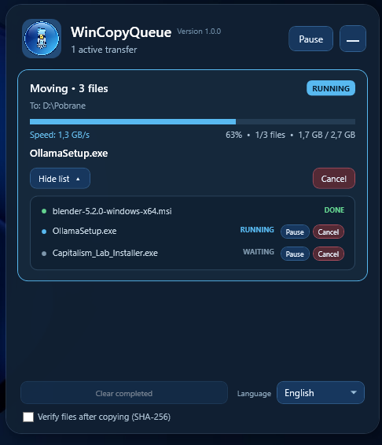

<p align="center">
  
</p>

<p align="center">
  <a href="README.md">English</a> · <a href="README.pl.md">Polski</a> · <a href="README.de.md">Deutsch</a> · <a href="README.fr.md">Français</a> · <a href="README.es.md">Español</a> · <a href="README.pt.md">Português</a> · <strong>简体中文</strong> · <a href="README.ja.md">日本語</a>
</p>

# WinCopyQueue

WinCopyQueue 为 Windows 资源管理器添加了一个简单的复制和移动队列。它不会同时执行多个传输，而是按顺序处理：一个会话接一个会话，并且每次只处理一个文件。

应用程序常驻系统托盘，不会一直占用一个主窗口。只有在添加传输任务后，紧凑的队列面板才会出现；你可以随时隐藏它，传输仍会继续在后台运行。

## 下载

当前版本：**1.0.0**

- [下载 WinCopyQueue 1.0.0 安装程序](https://github.com/quendae/WinCopyQueue/releases/download/v1.0.0/WinCopyQueue-Setup-1.0.0-x64.exe)
- [下载独立版 WinCopyQueue.exe](https://github.com/quendae/WinCopyQueue/releases/download/v1.0.0/WinCopyQueue.exe)
- [查看 v1.0.0 版本](https://github.com/quendae/WinCopyQueue/releases/tag/v1.0.0)

WinCopyQueue 支持 **Windows 10 1809 或更高版本**，包括 Windows 11。安装程序仅为当前用户安装，不需要管理员权限。

> 此仓库目前不包含 `LICENSE` 文件。

## 使用方式

1. 启动 `WinCopyQueue.exe`。
2. 在 Windows 资源管理器中像平常一样使用 `Ctrl+C` / `Ctrl+X` 复制或剪切文件。
3. 在目标文件夹中按 `Ctrl+V`，或在右键菜单中选择 **使用 WinCopyQueue 粘贴**。

如果已经有传输正在进行，新任务会直接加入队列末尾。这样可以避免多个大型操作同时争用同一个磁盘。

在 Windows 11 中，静态右键菜单项可能位于 **显示更多选项** 中。

<p align="center">
  
</p>

## 主要功能

- 复制和移动单个文件或整个文件夹，
- 多个独立会话共用一个顺序队列，
- 暂停和继续整个队列或单个文件，
- 取消整个会话或选定文件，
- 取消会话时保留已经成功复制的目标文件，
- 文件冲突处理，并比较路径、大小和修改时间，
- 提供 **替换**、**跳过** 和 **取消会话**，并可将选择应用到后续冲突，
- 紧凑的队列面板显示当前文件、进度、文件数量和传输速度，
- 可展开的虚拟化文件列表，显示所有文件及其状态，
- 保留已完成、已取消和失败会话的历史记录，
- 在任务添加、完成或失败时显示系统通知，
- 可选的 Windows 自动启动，
- 八种界面语言：英语、波兰语、德语、法语、西班牙语、葡萄牙语、简体中文和日语。

## 更安全的复制和移动

WinCopyQueue 不会直接使用最终文件名写入未完成的文件。数据会先写入临时文件 `*.queue-part-*`，只有在传输成功完成后才会使用最终名称发布。

普通复制任务可以选择启用 **SHA-256** 校验。WinCopyQueue 会在复制时计算源数据的哈希值，然后重新读取目标文件进行比较。

在不同卷之间移动文件时，无论界面中的校验选项是否开启，系统都会在删除源文件之前自动执行校验。如果复制、校验或最终处理失败，源文件会保持不变。

## 队列面板和系统托盘

添加传输任务后，队列面板会自动打开，并显示在屏幕右下角附近，同时不会抢占资源管理器的焦点。你可以将其最小化，传输仍会在后台继续。

双击托盘图标或选择 **显示队列** 即可再次打开面板。托盘菜单还可以暂停或继续整个队列、切换自动启动、修复资源管理器集成以及退出应用程序。

## 文件冲突

如果目标位置已经存在同名文件，WinCopyQueue 会显示源文件和目标文件，并列出各自的大小和修改时间。可选择以下三种操作：

- **替换**，
- **跳过**，
- **取消会话**。

“替换”或“跳过”也可以应用到同一会话中的所有后续冲突。

## 设置和诊断

用户设置保存在：

```text
%LOCALAPPDATA%\WinCopyQueue\settings.json
```

诊断日志位于：

```text
%LOCALAPPDATA%\WinCopyQueue\WinCopyQueue.log
```

所选语言和 SHA-256 校验设置会在下次启动时保留。

## 命令行

WinCopyQueue 也可以直接从命令行接收传输任务：

```powershell
WinCopyQueue.exe --copy "D:\目标" "D:\文件.txt" "D:\文件夹"
WinCopyQueue.exe --move "D:\目标" "D:\文件.txt"
WinCopyQueue.exe --paste "D:\目标"
```

再次启动应用程序不会创建第二个队列。命令会通过 named pipe 转发到主进程。

## 构建项目

需要 .NET 10 SDK。

```powershell
dotnet restore WinCopyQueue.slnx --configfile NuGet.Config
dotnet build WinCopyQueue.slnx --no-restore -c Release
```

从仓库运行应用程序：

```powershell
dotnet run --project src\WinCopyQueue.App\WinCopyQueue.App.csproj --no-restore
```

### 测试

```powershell
dotnet run --project tests\WinCopyQueue.Core.SmokeTests\WinCopyQueue.Core.SmokeTests.csproj --no-build -c Release
dotnet run --project tests\WinCopyQueue.App.SmokeTests\WinCopyQueue.App.SmokeTests.csproj --no-build -c Release
```

核心 smoke test 会在隔离的临时文件上执行真实文件操作，并检查会话顺序、冲突、SHA-256、暂停/继续、取消、历史清理以及单文件控制。应用程序测试覆盖 WPF、本地化、冲突对话框和关闭流程。

### 安装程序

使用以下脚本构建安装程序：

```powershell
.\installer\Build-Installer.ps1
```

脚本会发布自包含的 `win-x64` 版本，并使用 Inno Setup 7 创建安装程序。最终二进制文件发布在 [Releases](https://github.com/quendae/WinCopyQueue/releases) 中，而不会存放在仓库里。

## 项目结构

```text
src/WinCopyQueue.Core/       队列逻辑和文件操作
src/WinCopyQueue.App/        WPF 应用、托盘和资源管理器集成
tests/                       核心和应用程序 smoke test
installer/                   Inno Setup 定义和构建脚本
```
